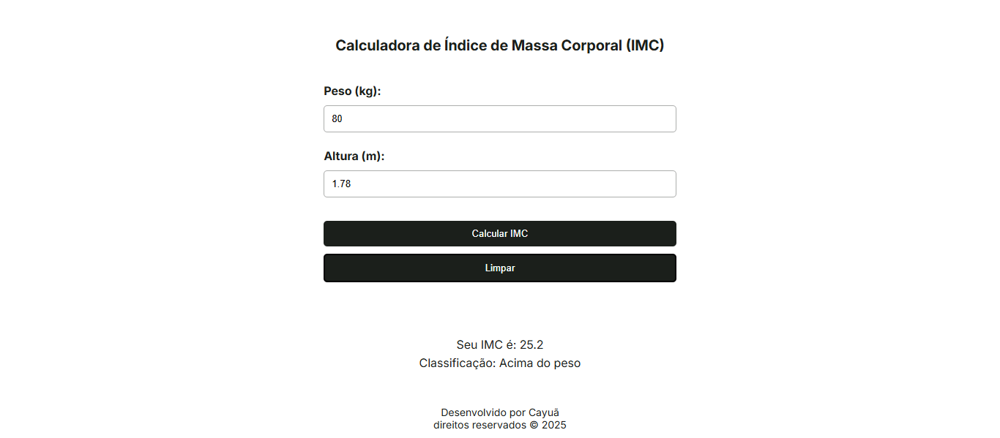

# Calculadora de IMC 

## Descrição
Esta é uma aplicação simples para calcular o Índice de Massa Corporal (IMC) usando HTML, CSS e JavaScript. O IMC é uma medida utilizada para avaliar se uma pessoa está dentro de um peso saudável em relação à sua altura.

## Preview

### Tela Desktop

### Tela Mobile

## Objetivo
Este projeto teve como objetivo praticar habilidades em manipulação do DOM, responsividade e interação com o usuário. Foram utilizados HTML para estruturar a página, CSS para estilização e JavaScript para implementar a lógica de cálculo do IMC e controlar os elementos da interface.

## Tecnologias Utilizadas
- HTML  
- CSS
- JavaScript
- Manipulação do DOM
- Responsividade com Media Queries

## Funcionalidades
- Entrada de peso e altura pelo usuário.
- Cálculo do IMC com base nos valores inseridos.
- Exibição do resultado do IMC e uma mensagem interpretativa.
- Responsividade para diferentes tamanhos de tela.

## Como Usar
1. Abra o arquivo `index.html` em um navegador web.
2. Insira seu peso em quilogramas e sua altura em metros.   
3. Clique no botão "Calcular IMC".
4. O resultado do IMC será exibido junto com uma mensagem interpretativa.

🔗 [Acesse aqui a calculadora online](https://imcweb.netlify.app/)

## Licença

Este projeto está sob a licença MIT. Para mais detalhes, consulte o arquivo [LICENSE](LICENSE).
